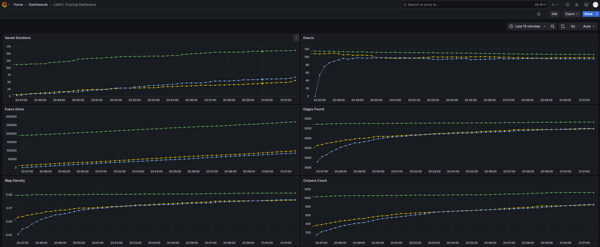

# StatsD Monitor

In modern fuzzing situations, it is very common to have multiple fuzzing instances running. LibAFL supports monitoring mutiple fuzzing instances with `StatsdMonitor`, which can be easily enabled by adding `statsd_monitor` feature in `Cargo.toml`:

```toml
[dependencies]
libafl = { version = "*", features = ["statsd_monitor"]}
```

After setting up a StatsD monitor infrastructure, you could view all of your fuzzing instances in a browser like this one (each line represents metrics of one fuzzing instance).



## Introduction to StatsD Architecture

A typical StatsD setup involves four participants: multiple StatsD clients, a StatsD aggregator, a Prometheus, and a visualizer.

Normally, each fuzzing instance is bound to a StatsD client (the `StatsdMonitor`). The StatsD client pushes fuzzing metrics (e.g. exec per second) towards the StatsD aggregator consistently. The Prometheus server is the center of StatsD metrics, which polls StatsD metrics from the StatsD aggregator at a specific polling frequency. The visualizer queries the Prometheus server, and display the metrics for further analysis and monitoring.

## Set up a StatsD Monitor Infrastructure

The easiest way to install and set up the infrastructure is with Docker and Docker Compose. To begin with, create a directory with the following files:

* `docker-compose.yml`
    ```yml
    networks:
      statsd-net:
        driver: bridge
    
    volumes:
      grafana-data:

    services:
      prometheus:
        image: prom/prometheus
        container_name: prometheus
        volumes:
          - ./prometheus.yml:/prometheus.yml
        command:
          - '--config.file=/prometheus.yml'
        restart: unless-stopped
        ports:
          - "9090:9090"
        networks:
          - statsd-net

      statsd_exporter:
        image: prom/statsd-exporter
        container_name: statsd_exporter
        volumes:
          - ./statsd_mapping.yml:/statsd_mapping.yml
        command:
          - "--statsd.mapping-config=/statsd_mapping.yml"
        ports:
          - "9102:9102/tcp"
          - "8125:9125/udp"
        networks:
          - statsd-net

      grafana:
        image: grafana/grafana
        container_name: grafana
        volumes:
          - grafana-data:/var/lib/grafana
        restart: unless-stopped
        ports:
            - "3000:3000"
        networks:
          - statsd-net
    ```
* `prometheus.yml`

    ```yml
    global:
      scrape_interval:      15s
      evaluation_interval:  15s

    scrape_configs:
      - job_name: 'fuzzing_metrics'
        static_configs:
          - targets: ['statsd_exporter:9102']
    ```
* `statsd_mapping.yml`

    ```yml
    mappings:
    - match: "fuzzing.*"
      name: "fuzzing"
      labels:
          type: "$1"
    ```

And use

```shell
docker compose up -d
```

Then the basic infrastructure is set up.

It is worth noting that all participants are not necessarily be in the same machine, as long as they could communicate with each other with network. Specifically, the StatsD aggregator should be accessible from StatsD clients and Prometheus server, and the Prometheus server should be accessible from the visualizer.

In this infrastructure setup, we choose the [prometheus/statsd-exporter](https://github.com/prometheus/statsd_exporter) as a StatsD aggregator, which aggregates metrics from multiple StatsD clients, and converts the metrics into Prometheus format. And we choose the [Grafana](https://grafana.com) as the visualizer.

### Configure Grafana

After the infrastructure is set up, you should use a browser and go to `localhost:3000` to configure Grafana, the visualizer, and view StatsD metrics (the default username and password for Grafana docker login is admin/admin).

First, you should add the Prometheus server as data source for Grafana, as described in [Add a data source](https://grafana.com/docs/grafana/latest/datasources/#add-a-data-source). By picking "Prometheus" as datasource type, you could create a data source with name "prometheus", and use `http://prometheus:9090` as Prometheus server URL (Docker network could automatically resolve the host name to the IP of prometheus service, and the port is specified at `docker-compose.yml` above).

Then, you should create a dashboard to view the metrics. You could simply importing [this dashboard template](../resources/grafana-libafl.json), or create a dashboard manually by following [this official guide](https://grafana.com/docs/grafana/latest/dashboards/build-dashboards/create-dashboard/#create-a-dashboard).

After the dashboard is created, all metrics can be viewed directly.

## Use `StatsdMonitor` in LibAFL

It is rather easy to use the `StatsdMonitor` in LibAFL. Let's say you were using a `MultiMonitor` previously:

```rust,ignore
let monitor = MultiMonitor::new(|s| println!("{s}"));
```

Then you could just create a `StatsdMonitor` and combine this two monitors with a `tuple_list!`:

```rust,ignore
let multi_monitor = MultiMonitor::new(|s| println!("{s}"));
let statsd_monitor = StatsdMonitor::new("localhost".to_string(), 8125, StatsdMonitorTagFlavor::default());
let monitor = tuple_list!(multi_monitor, statsd_monitor);
```

Then the monitor will automatically push StatsD metrics towards the StatsD aggregator at localhost:8125, which is specified in the `docker-compose.yml` above.

### Tag Flavor

The vanilla StatsD metrics do not have a mechanism to distinguish different StatsD clients, which is inconvenience to view multiple fuzzing instances. Several StatsD servers have introduced a new mechanism called tag to solve this problem, and in LibAFL, we currently support [Datadog](https://docs.datadoghq.com/developers/dogstatsd/) style tag, which is the default for `StatsdMonitorTagFlavor`.

To use tag correctly, we should create a `StatsdMonitorTagFlavor` with a tag identifier and optional custom tags.

```rust,ignore
let tag_flavor = StatsdMonitorTagFlavor::DogStatsd {
    tag_identifier: "unique-name-for-this-fuzzing-instance".into(),
    custom_tags: vec![
        ("custom-tag-key".into(), "custom-tag-value".into())
    ],
};
let statsd_monitor = StatsdMonitor::new("localhost".to_string(), 8125, tag_flavor);
```

The tag identifier is used to differentiate StatsD clients, which should be unique for each fuzzing instances. The optional custom tags could be used by Grafana users to filter clients based on custom informations.

## FAQ

### What can I do if I cannot see any metrics in Grafana?

To debug the `StatsdMonitor`, you could first comment out all other monitors for clarity. The you could setup a log implementation such as [`env_logger`](https://crates.io/crates/env_logger) at the top of your `main` function. For `env_logger`, run the target application with environment `RUST_LOG=info`, and you could see logs from LibAFL. The output logs should contain error logs of `StatsdMonitor` if connection is down or anything unexpected.

If you still have no idea why things went wrong, please [file an issue](https://github.com/AFLplusplus/LibAFL/issues/new/choose) to LibAFL.

### Does network interactions of StatsD decrease the fuzzing throughput?

Thanks to the [`cadence`](https://crates.io/crates/cadence) crate which we used as StatsD client implementation, the network interaction is conduct in an individual thread, so the affect from network interactions could be negligible.

### Can I optionally enable the `StatsdMonitor` via something like commandline options?

You can wrap the `StatsdMonitor` with an `OptionalMonitor`:

```rust,ignore
let statsd_monitor = if commandline_is_set {
    Some(StatsdMonitor::new(/* ... */))
} else {
    None
};
let optional_statsd_monitor = OptionalMonitor::new(statsd_monitor);
```

### What is the different between `StatsdMonitor` and `PrometheusMonitor`?

The `PrometheusMonitor` could be used to view detailed statistics about one fuzzing instance (with multiple clients maybe), since it can show the statistics about individual clients. And `PrometheusMonitor` is implemented as a Prometheus datasource, which will, based on the pull-architecture of Prometheus, occupy a port for each instance for Prometheus server to access.

The `StatsdMonitor` is used to view aggregated statistics about multiple fuzzing instances (showing individual client statistics will make the visualized graph very distracting). And due to the push-architecture of StatsD server, we only need one port for the StatsD aggregator to receive metrics from each client.

## References

* [AFL++'s docs about rpc_statsd](https://github.com/AFLplusplus/AFLplusplus/blob/stable/docs/rpc_statsd.md)
* [Prometheus wikipedia](https://en.wikipedia.org/wiki/Prometheus_(software))
